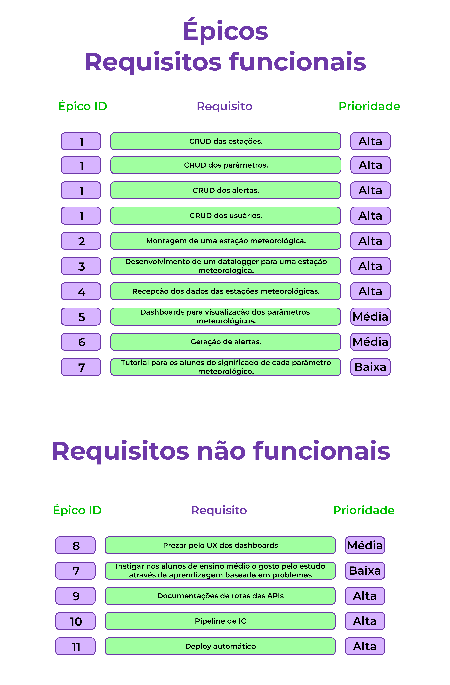
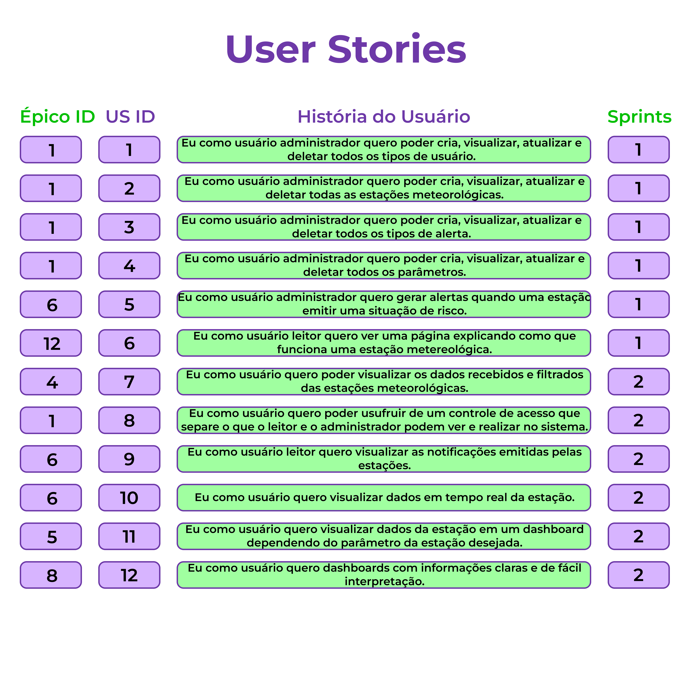
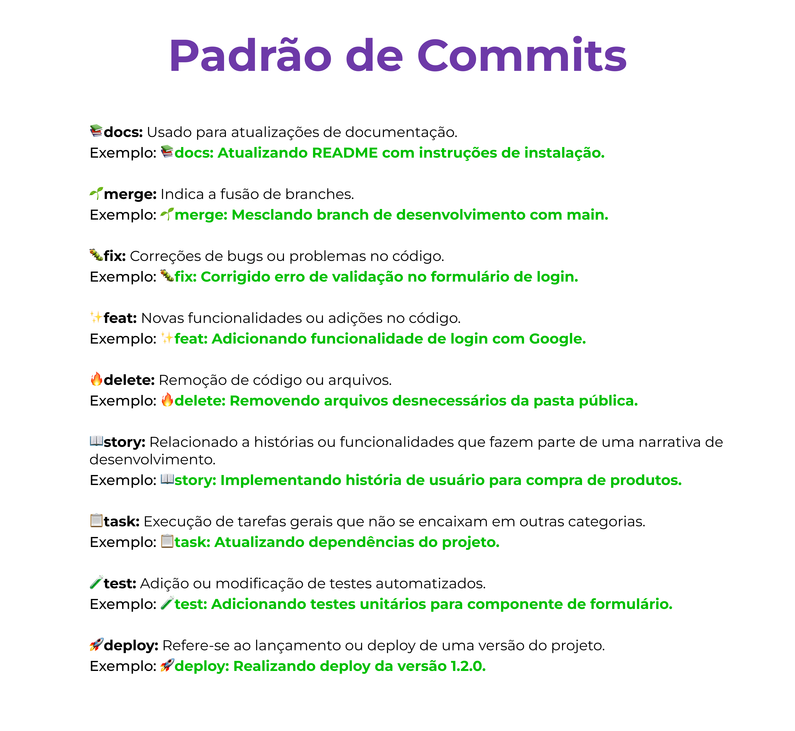

<!-- Para melhor visualização do código, tire a quebra de linha automatica. -->
 

<h1> FATEC Profº Jessen Vidal - São José dos Campos - 4º Semestre DSM </h1>

    
<h2> 💻 Sobre o projeto: </h2>
Projeto desenvolvido para a API (Aprendizagem por Projeto Integrado) do 4° semestre de Desenvolvimento de Software Multiplataforma (DSM). O objetivo do projeto é o desenvolvimento de um sistema de coleta de dados de estações meteorológicas. A plataforma deve receber as informações da estação metereológica e em caso de emergência mostrar uma notificação alertando a população.

 

<h3> 📌 Status do projeto: Em andamento ⏳ </h3>

 

    
<h3> 👾 Tecnologias utilizadas até o momento: </h3>

 

<h2> 🎯 MVP </h2>

 

    
<h2> 🚩 Sprints </h2>

<table >
    <tr>
        <th> Sprint </th>
        <th> Início </th>
        <th> Entrega </th>
        <th> Relatório </th>
        <th> Status </th>
    </tr>
    <tr align="center">
        <td> 1 </td>
        <td> 09/09 </td>
        <td> 29/09 </td>
        <td> 🚧 </td>
        <td> Concluída</td>
    </tr>
     <tr align="center">
        <td> 2 </td>
        <td> 30/09 </td>
        <td> 20/10 </td>
        <td> 🚧 </td>
        <td> Não iniciada </td>
    </tr>
     <tr align="center">
        <td> 3 </td>
        <td> 21/10 </td>
        <td> 10/11 </td>
        <td> 🚧 </td>
        <td> Não iniciada </td>
    </tr>
     <tr align="center">
        <td> 4 </td>
        <td> 11/11 </td>
        <td> 01/12 </td>
        <td> 🚧 </td>
        <td> Não iniciada </td>
    </tr>
</table>

 

    
<h2> 📓 Backlog Total </h2>

<h3> Épicos (Requisitos Funcionais) </h3>
 

<h3> User Stories </h3>

 

<h2> Padrão de commit </h2>

<h2> 👨‍💻 Equipe </h2>
    
<table>
    <tr>
        <th> Foto </th>
        <th> Função </th>
        <th> Nome </th>
        <th> Linkedin </th>
        <th> Git Hub </th>
    </tr>
    <tr>
        <td>  </td>
        <td> Scrum Master </td>
        <td> Laura Gabriel Gonçalves </td>
        <td>  </td>
        <td>  </td>
    </tr>
    <tr>
          <td>  </td>
          <td> Product Owner </td>
          <td> Pedro Henrique de Souza </td>
          <td>  </td>
          <td>  </td>
      </tr>
    <tr>
        <td> </td>
        <td> Dev Team </td>
        <td> Felipe Gabriel Vieira </td>
        <td>  </td>
        <td>  </td>
    </tr>
  <tr>
     <td>  </td>
          <td> Dev Team </td>
          <td> Letícia Helena de Oliveira Carvalho </td>
          <td>  </td>
    <td>  </td>
    </tr>
  </tr>
    <tr>
        <td>  </td>
        <td> Dev Team </td>
        <td> Livia Alves de Faria </td>
        <td>  </td>
        <td>  </td>
    </tr>
    <tr>
        <td>  </td>
        <td> Dev Team </td>
        <td> Víctor dos Santos Salles </td>
        <td>  </td>
        <td>  </td>
    </tr>
</table>
    
 

<a href="#topo">[Voltar ao topo]</a>
